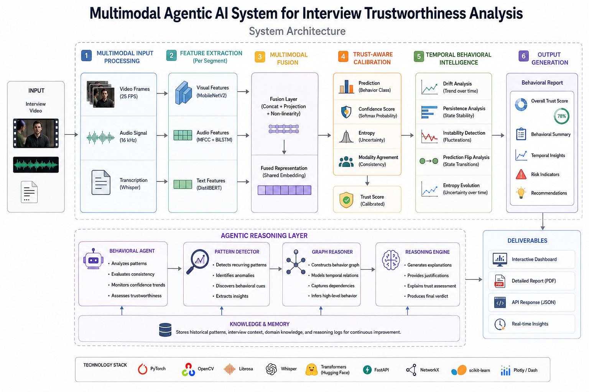

# Multimodal Agentic AI System for Interview Trustworthiness Analysis

## Overview

The Multimodal Agentic AI System for Interview Trustworthiness Analysis is an intelligent behavioral analysis framework designed to evaluate the trustworthiness, consistency, and reliability of human responses during interviews.

Unlike traditional emotion recognition systems that focus solely on identifying emotional states, this project introduces a multimodal reasoning architecture capable of analyzing temporal behavioral patterns, modality agreement, confidence calibration, uncertainty estimation, and behavioral consistency over time.

The system integrates computer vision, speech analysis, natural language understanding, trust-aware fusion, and agentic reasoning to provide a comprehensive assessment of interview behavior.

---

## Motivation

Human communication is inherently multimodal. During interviews, a person's verbal statements, vocal characteristics, facial expressions, and behavioral patterns collectively contribute to perceived credibility.

Traditional systems often evaluate these signals independently and fail to capture:

* Behavioral consistency
* Cross-modal agreement
* Temporal evolution of responses
* Reliability of predictions
* Trustworthiness indicators

This project aims to bridge this gap through a unified multimodal architecture capable of reasoning about behavioral patterns rather than merely classifying emotions.

---

# System Architecture


The proposed framework consists of five major layers:

```text
Input Video
      │
      ▼
┌────────────────────┐
│ Multimodal Input   │
└────────────────────┘
      │
      ▼
┌────────────────────┐
│ Feature Extraction │
└────────────────────┘
      │
      ▼
┌────────────────────┐
│ Multimodal Fusion  │
└────────────────────┘
      │
      ▼
┌────────────────────┐
│ Trust Calibration  │
└────────────────────┘
      │
      ▼
┌────────────────────┐
│ Temporal Reasoning │
└────────────────────┘
      │
      ▼
┌────────────────────┐
│ Agentic Analysis   │
└────────────────────┘
      │
      ▼
Behavioral Report
```

---

# Core Components

## 1. Video Understanding Module

The visual analysis module extracts behavioral cues from facial expressions and body language.

### Backbone

* MobileNetV2
* Transfer Learning
* Feature Embedding Generation

### Responsibilities

* Facial behavior analysis
* Visual feature extraction
* Frame-level representation learning
* Temporal visual consistency analysis

---

## 2. Audio Analysis Module

Speech signals are processed to capture vocal characteristics.

### Features

* MFCC Extraction
* Spectral Characteristics
* Prosodic Information

### Model

* Bidirectional LSTM (BiLSTM)

### Responsibilities

* Voice pattern recognition
* Speech dynamics analysis
* Vocal confidence estimation

---

## 3. Text Understanding Module

Natural language understanding is performed on interview transcripts.

### Pipeline

Video
→ Audio Extraction
→ Whisper Transcription
→ DistilBERT Processing

### Model

* DistilBERT
* Transformer-based embeddings

### Responsibilities

* Semantic understanding
* Linguistic consistency analysis
* Textual confidence estimation

---

## 4. Multimodal Fusion Layer

Information from visual, audio, and textual modalities is integrated into a shared representation space.

### Objectives

* Cross-modal feature integration
* Behavioral representation learning
* Unified decision making

### Benefits

* Reduced modality-specific bias
* Improved robustness
* Better behavioral understanding

---

# Trust-Aware Reasoning Framework

Traditional classification systems output only predictions.

This project extends prediction capabilities through trust-aware reasoning.

The framework computes:

### Prediction Confidence

Measures certainty of model outputs.

### Entropy

Measures uncertainty in predictions.

Lower entropy indicates stronger confidence.

### Modality Agreement

Evaluates consistency among:

* Video predictions
* Audio predictions
* Text predictions

### Trust Score

Combines confidence, uncertainty, and agreement into a unified trust metric.

---

# Temporal Behavioral Intelligence

One of the key contributions of this project is Temporal Behavioral Intelligence.

Instead of analyzing a single prediction, the framework studies how behavior evolves across time.

---

## Drift Analysis

Measures gradual changes in behavioral patterns.

Used to identify:

* Response shifts
* Emotional transitions
* Behavioral deviations

---

## Persistence Analysis

Measures how long behavioral states remain stable.

Used to detect:

* Consistent behavior
* Sustained confidence
* Stable responses

---

## Instability Detection

Quantifies fluctuations between behavioral states.

Higher instability may indicate:

* Inconsistent responses
* Uncertainty
* Behavioral volatility

---

## Prediction Flip Analysis

Tracks transitions between predicted states.

Example:

```text
Confident
→ Nervous
→ Confident
→ Uncertain
```

Frequent flips may indicate inconsistency.

---

## Entropy Evolution

Studies how uncertainty changes throughout the interview.

Used to detect:

* Increasing confidence
* Growing uncertainty
* Response reliability trends

---

# Agentic Reasoning Layer

A dedicated reasoning engine interprets behavioral signals.

Components include:

### Behavioral Agent

Analyzes:

* Confidence trends
* Consistency patterns
* Temporal behavior

### Pattern Detector

Discovers recurring behavioral structures.

### Graph Reasoner

Represents behavioral relationships using graph-based reasoning.

### Reasoning Engine

Generates interpretable explanations behind trust assessments.

---

# Dataset Preparation

## IEMOCAP Dataset

Used for pretraining multimodal representations.

### Purpose

* Emotional understanding
* Feature initialization
* Representation learning

---

## Custom Behavioral Dataset

A custom interview dataset was collected.

### Dataset Statistics

* 120 recorded interview videos
* Multiple interview scenarios
* Diverse behavioral responses
* Temporal annotations

### Purpose

* Behavioral consistency analysis
* Trustworthiness evaluation
* Real-world testing

---

# Training Pipeline

## Stage 1

Pretraining on IEMOCAP

```text
IEMOCAP
      │
      ▼
Feature Learning
```

---

## Stage 2

Fine-tuning on custom interview dataset

```text
Custom Dataset
      │
      ▼
Behavioral Adaptation
```

---

## Stage 3

Trust Calibration

```text
Predictions
      │
      ▼
Confidence Calibration
```

---

## Stage 4

Temporal Behavioral Analysis

```text
Segment Predictions
      │
      ▼
Behavioral Intelligence
```

---

# Experimental Results

## Classification Performance

| Metric    | Score  |
| --------- | ------ |
| Accuracy  | 70.83% |
| Precision | 81.34% |
| Recall    | 70.83% |
| F1 Score  | 70.41% |

---

## Key Observations

### Strong Precision

The system demonstrates high precision, indicating reliable positive predictions.

### Stable Temporal Reasoning

Behavioral trends remain interpretable across interview segments.

### Effective Fusion

Multimodal fusion significantly improves robustness compared to single-modality approaches.

### Trust Calibration

Confidence and entropy measurements provide additional reliability insights beyond standard classification metrics.

---

# Technology Stack

## Deep Learning

* PyTorch
* TorchVision
* Transformers

## Computer Vision

* MobileNetV2
* OpenCV

## Audio Processing

* Librosa
* FFmpeg

## Natural Language Processing

* DistilBERT
* Whisper

## Backend

* FastAPI
* Uvicorn

## Deployment

* Python
* REST APIs

---

# API Workflow

```text
Video Upload
      │
      ▼
/analyze Endpoint
      │
      ▼
Multimodal Processing
      │
      ▼
Trust Evaluation
      │
      ▼
Behavioral Report
```

---

# Future Enhancements

* Real-time interview monitoring
* Large Language Model integration
* Reinforcement Learning based reasoning
* Graph Neural Networks
* Explainable AI dashboards
* Multi-agent behavioral analysis
* Human-in-the-loop evaluation

---

# Research Contributions

This work introduces:

1. Trust-aware multimodal fusion.
2. Temporal Behavioral Intelligence framework.
3. Agentic behavioral reasoning architecture.
4. Confidence and entropy-based trust calibration.
5. Explainable trustworthiness assessment pipeline.

---

# Author

Raghav Pimoli

Master of Science (Artificial Intelligence and Machine Learning)

Indian Institute of Information Technology Lucknow

---

# License

This project is released under the MIT License.

---

# Citation

If you use this work in research, please cite:

```bibtex
@mastersthesis{pimoli2026multimodal,
  title={Multimodal Agentic AI System for Interview Trustworthiness Analysis},
  author={Pimoli, Raghav},
  school={Indian Institute of Information Technology Lucknow},
  year={2026}
}
```
